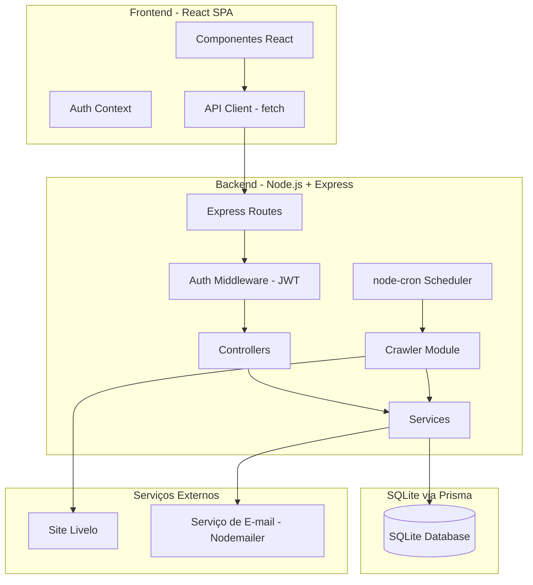
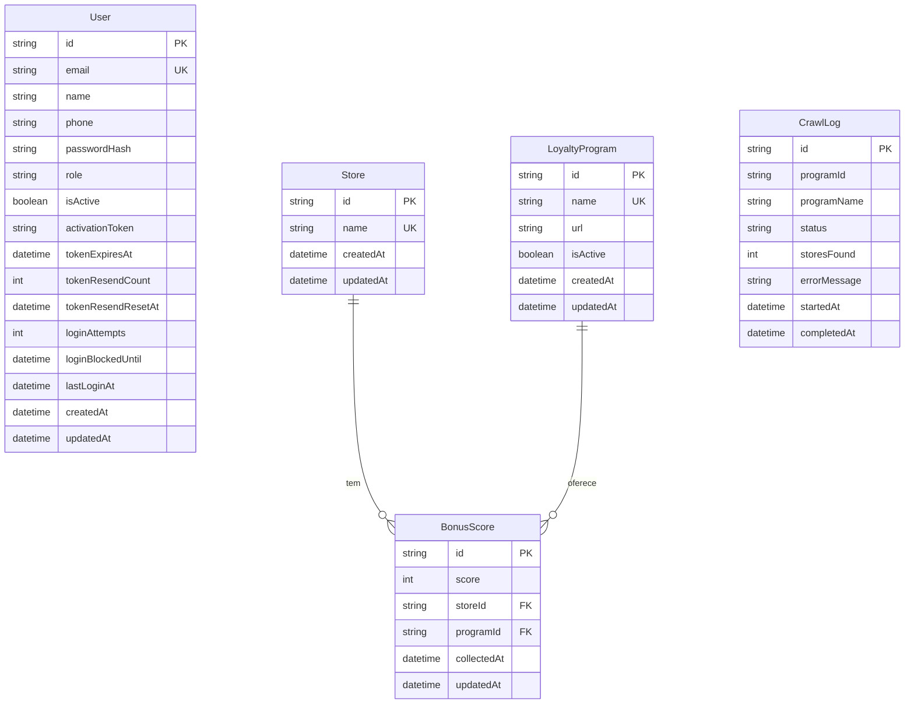

# Design Técnico - Compras Bonificadas

## Visão Geral

O sistema Compras Bonificadas é uma aplicação web full-stack composta por:

- **Backend**: API REST em Node.js + Express com Prisma ORM e SQLite
- **Frontend**: SPA em React para visualização de promoções e administração
- **Crawler**: Módulo de coleta automatizada executado via cron jobs internos

A arquitetura segue o padrão de camadas (layered architecture) com separação clara entre apresentação, lógica de negócio e acesso a dados. O crawler opera como um serviço interno do backend, disparado por agendamento (node-cron).

### Diagrama de Arquitetura



### Fluxo de Dados Principal

1. **Crawler** coleta promoções dos sites de programas de fidelidade nos horários agendados
2. **Services** processam e persistem os dados no SQLite via Prisma
3. **API REST** expõe endpoints para o frontend consumir
4. **Frontend React** exibe as promoções com filtros e paginação

## Arquitetura

### Estrutura de Diretórios

```
/
├── prisma/
│   ├── schema.prisma
│   └── migrations/
├── src/
│   ├── server.ts                 # Entry point
│   ├── app.ts                    # Express app setup
│   ├── config/
│   │   ├── database.ts           # Prisma client singleton
│   │   ├── scheduler.ts          # node-cron config
│   │   └── env.ts                # Variáveis de ambiente
│   ├── middleware/
│   │   ├── auth.ts               # JWT verification
│   │   ├── rateLimiter.ts        # Rate limiting
│   │   └── errorHandler.ts       # Error handling global
│   ├── routes/
│   │   ├── auth.routes.ts
│   │   ├── admin.routes.ts
│   │   ├── stores.routes.ts
│   │   └── programs.routes.ts
│   ├── controllers/
│   │   ├── auth.controller.ts
│   │   ├── admin.controller.ts
│   │   ├── stores.controller.ts
│   │   └── programs.controller.ts
│   ├── services/
│   │   ├── auth.service.ts
│   │   ├── user.service.ts
│   │   ├── store.service.ts
│   │   ├── program.service.ts
│   │   ├── crawler.service.ts
│   │   └── email.service.ts
│   ├── crawler/
│   │   ├── index.ts              # Orquestrador do crawler
│   │   ├── scrapers/
│   │   │   ├── base.scraper.ts   # Interface base
│   │   │   └── livelo.scraper.ts # Implementação Livelo
│   │   └── parser.ts             # Parsing de dados coletados
│   ├── validators/
│   │   ├── auth.validator.ts
│   │   ├── admin.validator.ts
│   │   └── stores.validator.ts
│   └── utils/
│       ├── token.ts              # Geração de tokens
│       ├── password.ts           # Hash de senhas
│       └── pagination.ts         # Helpers de paginação
├── frontend/
│   ├── src/
│   │   ├── App.tsx
│   │   ├── main.tsx
│   │   ├── contexts/
│   │   │   └── AuthContext.tsx
│   │   ├── pages/
│   │   │   ├── LoginPage.tsx
│   │   │   ├── ActivationPage.tsx
│   │   │   ├── StoresPage.tsx
│   │   │   └── AdminPage.tsx
│   │   ├── components/
│   │   │   ├── StoreList.tsx
│   │   │   ├── StoreCard.tsx
│   │   │   ├── SearchFilter.tsx
│   │   │   ├── ScoreRangeFilter.tsx
│   │   │   ├── Pagination.tsx
│   │   │   └── UserForm.tsx
│   │   ├── hooks/
│   │   │   ├── useStores.ts
│   │   │   ├── useAuth.ts
│   │   │   └── useFilters.ts
│   │   └── services/
│   │       └── api.ts
│   └── package.json
├── tests/
│   ├── unit/
│   ├── integration/
│   └── property/
├── package.json
├── tsconfig.json
└── vitest.config.ts
```

### Decisões Técnicas

| Decisão | Justificativa |
|---------|---------------|
| SQLite | Simplicidade para MVP, sem necessidade de servidor de banco separado |
| Prisma | Type-safety, migrations automáticas, boa DX com TypeScript |
| node-cron | Agendamento interno sem dependência de crontab do SO |
| JWT (jsonwebtoken) | Autenticação stateless, adequada para SPA |
| Puppeteer/Playwright | Scraping de sites com JavaScript dinâmico (Livelo) |
| Zod | Validação de schemas no backend com inferência de tipos |
| bcrypt | Hash seguro de senhas |
| Nodemailer | Envio de e-mails (compatível com SMTP genérico) |

## Componentes e Interfaces

### Backend - Camada de Serviços

```typescript
// auth.service.ts
interface AuthService {
  login(email: string, password: string): Promise<{ token: string }>
  initiateActivation(email: string): Promise<void>
  validateToken(email: string, token: string): Promise<boolean>
  activateAccount(email: string, token: string, password: string, profile: ProfileData): Promise<void>
  resendToken(email: string): Promise<void>
}

// user.service.ts
interface UserService {
  createUser(data: CreateUserInput): Promise<User>
  findByEmail(email: string): Promise<User | null>
  updateProfile(userId: string, data: UpdateProfileInput): Promise<User>
  incrementLoginAttempts(email: string): Promise<number>
  resetLoginAttempts(email: string): Promise<void>
  isLoginBlocked(email: string): Promise<boolean>
}

// store.service.ts
interface StoreService {
  listStores(filters: StoreFilters): Promise<PaginatedResult<StoreWithScore>>
  upsertStore(name: string): Promise<Store>
  updateScore(storeId: string, programId: string, score: number): Promise<void>
  removeScoresNotInList(programId: string, storeNames: string[]): Promise<void>
}

// program.service.ts
interface ProgramService {
  listPrograms(): Promise<LoyaltyProgram[]>
  createProgram(data: CreateProgramInput): Promise<LoyaltyProgram>
  findByName(name: string): Promise<LoyaltyProgram | null>
}

// crawler.service.ts
interface CrawlerService {
  runAll(): Promise<CrawlResult[]>
  runForProgram(programId: string): Promise<CrawlResult>
}

// email.service.ts
interface EmailService {
  sendActivationEmail(to: string, token: string): Promise<void>
}
```

### Crawler - Interface Base

```typescript
// base.scraper.ts
interface ScraperResult {
  storeName: string
  score: number
}

interface BaseScraper {
  programName: string
  scrape(): Promise<ScraperResult[]>
}

// livelo.scraper.ts
class LiveloScraper implements BaseScraper {
  programName = 'Livelo'
  private url: string
  private timeout: number = 120_000 // 120 segundos

  async scrape(): Promise<ScraperResult[]> {
    // Usa Puppeteer para acessar o site da Livelo
    // Coleta nome da loja e pontuação bonificada
    // Retorna array de resultados
  }
}
```

### API Endpoints

| Método | Rota | Descrição | Auth |
|--------|------|-----------|------|
| POST | `/api/auth/login` | Login com e-mail e senha | Não |
| POST | `/api/auth/activate/initiate` | Inicia fluxo de ativação | Não |
| POST | `/api/auth/activate/confirm` | Confirma token e define senha | Não |
| POST | `/api/auth/activate/resend` | Reenvia token de ativação | Não |
| POST | `/api/auth/logout` | Encerra sessão | JWT |
| GET | `/api/stores` | Lista lojas com filtros e paginação | JWT |
| POST | `/api/admin/users` | Cadastra novo cliente | JWT + Admin |
| GET | `/api/admin/users` | Lista clientes cadastrados | JWT + Admin |
| GET | `/api/admin/programs` | Lista programas de fidelidade | JWT + Admin |
| POST | `/api/admin/programs` | Adiciona programa de fidelidade | JWT + Admin |
| POST | `/api/admin/crawler/run` | Executa crawler manualmente | JWT + Admin |

### Detalhes dos Endpoints

#### POST `/api/auth/login`
```typescript
// Request
{ email: string, password: string }

// Response 200
{ token: string, user: { id: string, email: string, name: string, role: string } }

// Response 401
{ error: "Credenciais inválidas" }

// Response 429
{ error: "Muitas tentativas. Tente novamente em 15 minutos." }
```

#### POST `/api/auth/activate/confirm`
```typescript
// Request
{ email: string, token: string, password: string, name?: string, phone?: string }

// Response 200
{ token: string, user: { id: string, email: string, name: string, role: string } }

// Response 400
{ error: "Token inválido ou expirado" }
```

#### GET `/api/stores`
```typescript
// Query params
{ page?: number, limit?: number, search?: string, minScore?: number, maxScore?: number }

// Response 200
{
  data: Array<{
    id: string,
    name: string,
    bestScore: number,
    programName: string,
    scores: Array<{ programName: string, score: number }>
  }>,
  pagination: { page: number, limit: number, total: number, totalPages: number }
}
```

#### POST `/api/admin/users`
```typescript
// Request
{ email: string, name?: string, phone?: string, sendActivationNow: boolean }

// Response 201
{ user: { id: string, email: string, name: string, activationStatus: "sent" | "pending" } }

// Response 400
{ error: "E-mail com formato inválido" }

// Response 409
{ error: "E-mail já cadastrado" }
```

## Modelos de Dados

### Schema Prisma

```prisma
generator client {
  provider = "prisma-client-js"
}

datasource db {
  provider = "sqlite"
  url      = env("DATABASE_URL")
}

model User {
  id                String    @id @default(uuid())
  email             String    @unique
  name              String?
  phone             String?
  passwordHash      String?
  role              String    @default("client") // "admin" | "client"
  isActive          Boolean   @default(false)
  activationToken   String?
  tokenExpiresAt    DateTime?
  tokenResendCount  Int       @default(0)
  tokenResendResetAt DateTime?
  loginAttempts     Int       @default(0)
  loginBlockedUntil DateTime?
  lastLoginAt       DateTime?
  createdAt         DateTime  @default(now())
  updatedAt         DateTime  @updatedAt
}

model LoyaltyProgram {
  id        String   @id @default(uuid())
  name      String   @unique
  url       String
  isActive  Boolean  @default(true)
  createdAt DateTime @default(now())
  updatedAt DateTime @updatedAt
  scores    BonusScore[]
}

model Store {
  id        String   @id @default(uuid())
  name      String   @unique
  createdAt DateTime @default(now())
  updatedAt DateTime @updatedAt
  scores    BonusScore[]
}

model BonusScore {
  id        String         @id @default(uuid())
  score     Int
  store     Store          @relation(fields: [storeId], references: [id], onDelete: Cascade)
  storeId   String
  program   LoyaltyProgram @relation(fields: [programId], references: [id], onDelete: Cascade)
  programId String
  collectedAt DateTime     @default(now())
  updatedAt   DateTime     @updatedAt

  @@unique([storeId, programId])
}

model CrawlLog {
  id          String   @id @default(uuid())
  programId   String
  programName String
  status      String   // "success" | "error"
  storesFound Int      @default(0)
  errorMessage String?
  startedAt   DateTime
  completedAt DateTime @default(now())
}
```

### Diagrama ER



## Propriedades de Corretude

*Uma propriedade é uma característica ou comportamento que deve ser verdadeiro em todas as execuções válidas de um sistema — essencialmente, uma declaração formal sobre o que o sistema deve fazer. Propriedades servem como ponte entre especificações legíveis por humanos e garantias de corretude verificáveis por máquina.*

### Property 1: Validação de e-mail aceita apenas formatos válidos

*Para qualquer* string de entrada, a função de validação de e-mail deve aceitar se e somente se a string contiver exatamente um caractere "@" com parte local não vazia (máximo 254 caracteres total) e domínio não vazio.

**Validates: Requirements 1.2, 1.3**

### Property 2: Rejeição de e-mail duplicado

*Para qualquer* e-mail válido já cadastrado no sistema, uma segunda tentativa de cadastro com o mesmo e-mail (case-insensitive) deve ser rejeitada com erro de duplicidade.

**Validates: Requirements 1.6**

### Property 3: Validação de senha aceita apenas formatos válidos

*Para qualquer* string de entrada, a função de validação de senha deve aceitar se e somente se a string tiver no mínimo 8 caracteres e contiver ao menos uma letra maiúscula, uma letra minúscula e um número.

**Validates: Requirements 2.3**

### Property 4: Limite de reenvios de token

*Para qualquer* sequência de N solicitações de reenvio de token para o mesmo e-mail dentro de um período de 24 horas, as primeiras 5 solicitações devem ter sucesso e qualquer solicitação subsequente (N > 5) deve ser rejeitada.

**Validates: Requirements 2.5**

### Property 5: Login retorna mensagem genérica para qualquer tipo de falha

*Para qualquer* tentativa de login que falhe (e-mail não cadastrado, conta inativa, ou senha incorreta), a mensagem de erro retornada deve ser idêntica ("Credenciais inválidas"), sem revelar qual campo está incorreto.

**Validates: Requirements 3.2**

### Property 6: Bloqueio após tentativas consecutivas de login

*Para qualquer* e-mail, após exatamente 5 tentativas consecutivas de login com falha, a próxima tentativa deve ser bloqueada por 15 minutos, independentemente de as credenciais estarem corretas.

**Validates: Requirements 3.4**

### Property 7: Sincronização do crawler - upsert de lojas

*Para qualquer* lista de resultados coletados pelo crawler, todas as lojas novas devem ser criadas no banco com nome e pontuação corretos, e todas as lojas já existentes devem ter sua pontuação atualizada com o valor mais recente.

**Validates: Requirements 4.3, 4.4**

### Property 8: Sincronização do crawler - remoção de lojas ausentes

*Para qualquer* execução bem-sucedida do crawler para um programa de fidelidade, as pontuações de lojas que não estão presentes na lista coletada devem ser removidas para aquele programa, enquanto pontuações de outros programas permanecem inalteradas.

**Validates: Requirements 4.5, 7.4**

### Property 9: Ordenação decrescente por melhor pontuação

*Para qualquer* conjunto de lojas com pontuações, a lista retornada pela API deve estar ordenada de forma que cada item tenha bestScore maior ou igual ao item seguinte.

**Validates: Requirements 5.1**

### Property 10: Consolidação e exibição do melhor score entre programas

*Para qualquer* loja com pontuações em N programas de fidelidade (N ≥ 1), o bestScore exibido deve ser o valor máximo entre todas as pontuações, e o programName deve corresponder ao programa que oferece essa pontuação máxima. A correspondência entre lojas de diferentes programas deve ser feita por nome exato (case-insensitive).

**Validates: Requirements 5.3, 5.4, 7.3**

### Property 11: Filtragem de lojas por critérios combinados

*Para qualquer* combinação de filtro de nome (string) e faixa de pontuação [min, max] onde min ≤ max, todas as lojas retornadas devem satisfazer simultaneamente: (a) o nome contém o termo de busca (case-insensitive), e (b) o bestScore está dentro da faixa [min, max] inclusive. Além disso, nenhuma loja que satisfaça ambos os critérios deve ser omitida do resultado. Se min > max, o sistema deve rejeitar a consulta.

**Validates: Requirements 6.1, 6.2, 6.3, 6.4**

### Property 12: Isolamento de dados entre programas de fidelidade

*Para qualquer* operação de adição de um novo programa de fidelidade ou falha na coleta de um programa específico, os scores e lojas associados a outros programas devem permanecer completamente inalterados.

**Validates: Requirements 7.1, 7.2**

## Tratamento de Erros

### Estratégia Global

O sistema utiliza um middleware centralizado de tratamento de erros (`errorHandler.ts`) que:

1. Captura exceções não tratadas em controllers/services
2. Mapeia erros de domínio para códigos HTTP apropriados
3. Retorna respostas padronizadas no formato `{ error: string, details?: object }`
4. Registra erros em log com contexto (stack trace em desenvolvimento)

### Classificação de Erros

| Tipo | Código HTTP | Exemplo |
|------|-------------|---------|
| Validação | 400 | E-mail inválido, senha fraca, faixa inválida |
| Autenticação | 401 | Token JWT expirado, credenciais inválidas |
| Autorização | 403 | Cliente tentando acessar rota admin |
| Não encontrado | 404 | Recurso inexistente |
| Conflito | 409 | E-mail duplicado |
| Rate limit | 429 | Bloqueio por tentativas de login |
| Erro interno | 500 | Falha inesperada |

### Erros Específicos do Crawler

```typescript
class CrawlerError extends Error {
  constructor(
    public programName: string,
    public phase: 'connection' | 'parsing' | 'timeout',
    message: string
  ) {
    super(message)
  }
}
```

Comportamento em caso de falha:
- **Timeout (120s)**: Aborta a coleta, registra em CrawlLog com status "error"
- **Erro de conexão**: Descarta dados parciais, registra erro, mantém dados anteriores
- **Erro de parsing**: Registra warning, pula item com problema, continua coleta
- **Falha em um programa**: Não afeta coleta de outros programas

### Erros de Autenticação

- Mensagens genéricas para evitar enumeração de usuários
- Rate limiting por IP e por e-mail
- Logs detalhados internos para auditoria (sem expor ao cliente)

## Estratégia de Testes

### Ferramentas

- **Vitest**: Framework de testes (unit + property)
- **fast-check**: Biblioteca de property-based testing para TypeScript
- **supertest**: Testes de integração HTTP
- **Prisma**: Banco em memória para testes (SQLite `:memory:`)

### Estrutura de Testes

```
tests/
├── unit/
│   ├── validators/
│   │   ├── email.validator.test.ts
│   │   └── password.validator.test.ts
│   ├── services/
│   │   ├── auth.service.test.ts
│   │   ├── store.service.test.ts
│   │   └── crawler.service.test.ts
│   └── utils/
│       └── pagination.test.ts
├── integration/
│   ├── auth.routes.test.ts
│   ├── stores.routes.test.ts
│   └── admin.routes.test.ts
└── property/
    ├── email-validation.property.test.ts
    ├── password-validation.property.test.ts
    ├── store-filtering.property.test.ts
    ├── store-sorting.property.test.ts
    ├── crawler-sync.property.test.ts
    ├── login-security.property.test.ts
    └── program-isolation.property.test.ts
```

### Abordagem Dual de Testes

**Testes Unitários (example-based):**
- Cenários específicos de sucesso e falha
- Edge cases concretos (banco vazio, conta já ativa, etc.)
- Integração entre componentes (rotas → controllers → services)
- Fluxos completos de ativação e login

**Testes de Propriedade (property-based com fast-check):**
- Mínimo de 100 iterações por propriedade
- Cada teste referencia a propriedade do design document
- Formato de tag: `Feature: compras-bonificadas, Property {N}: {título}`
- Generators customizados para e-mails, senhas, nomes de lojas, scores
- Uso de banco SQLite em memória para isolamento

### Configuração de Property Tests

```typescript
// Exemplo de configuração
import { fc } from 'fast-check'

// Generator de e-mail válido
const validEmailArb = fc.tuple(
  fc.stringOf(fc.char().filter(c => c !== '@' && c !== ' '), { minLength: 1, maxLength: 64 }),
  fc.stringOf(fc.char().filter(c => c !== '@' && c !== ' '), { minLength: 1, maxLength: 63 })
).map(([local, domain]) => `${local}@${domain}`)

// Configuração mínima de iterações
const propertyConfig = { numRuns: 100 }
```

### Cobertura por Requisito

| Requisito | Unit Tests | Property Tests | Integration Tests |
|-----------|-----------|---------------|-------------------|
| 1 - Cadastro | ✓ | Properties 1, 2 | ✓ |
| 2 - Ativação | ✓ | Properties 3, 4 | ✓ |
| 3 - Autenticação | ✓ | Properties 5, 6 | ✓ |
| 4 - Crawler | ✓ | Properties 7, 8 | ✓ |
| 5 - Exibição | ✓ | Properties 9, 10 | ✓ |
| 6 - Filtros | ✓ | Property 11 | ✓ |
| 7 - Extensibilidade | ✓ | Property 12 | ✓ |

